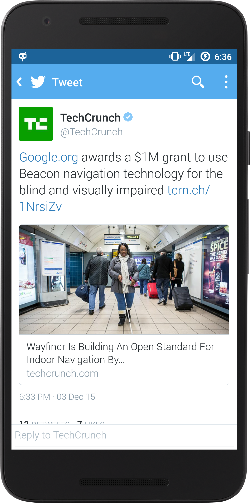
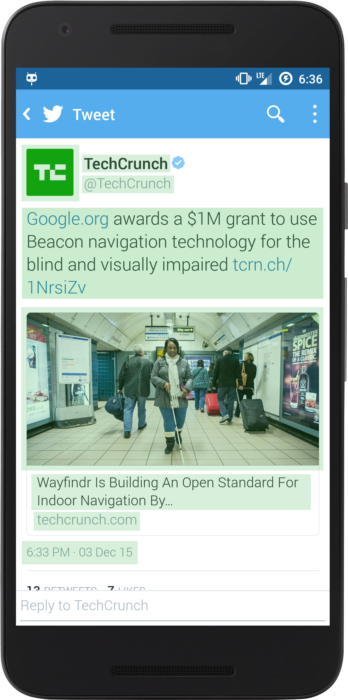
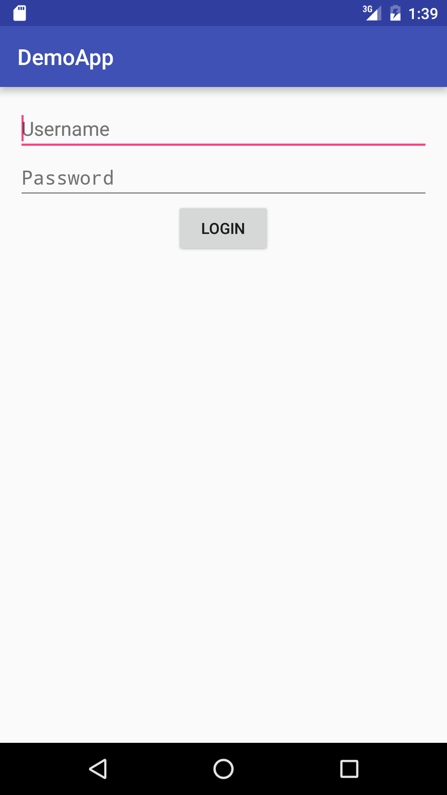
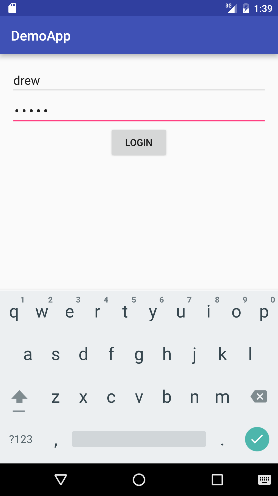
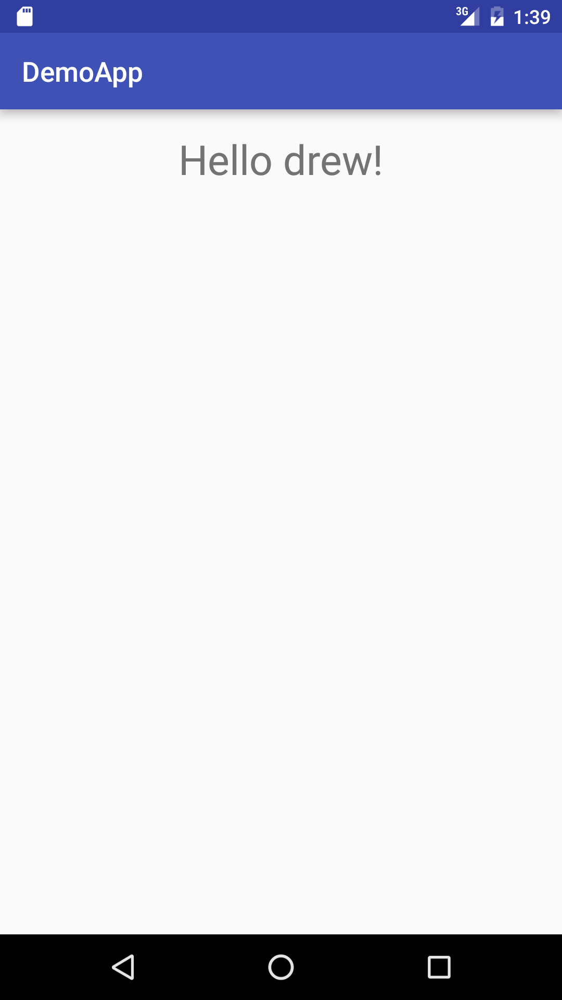

#  Introduction to Android

### LEARNING OBJECTIVES
*After this lesson, students will be able to:*
* Describe the basic history and concepts of Android
* Explain the strengths and weaknesses of Android
* Identify the basic Views in an Android app
* Create a basic two screen Android app, allowing the user to enter a username and password on a login screen, and then move to a welcome screen after logging in.

### INSTRUCTOR PREP
*Before this lesson, instructors will need to:*
- Make sure you have Android Studio installed and configured, including an emulator
- Have whiteboard markers ready for each student

## Opening (5 mins)

#### What is Android?

Android is a mobile operating system maintained by Google. It's an open source project, which can be defined as:

`Open-source software (OSS) is computer software with its source code made available with a license in which the copyright holder provides the rights to study, change, and distribute the software to anyone and for any purpose. Open-source software may be developed in a collaborative public manner.`

 In other words, [anyone can download the Android Operating System ](https://source.android.com/source/index.html) and modify it for free.

 This is the opposite of iOS, where the exact details about the operating system are only known by Apple, and no modifications or customization is allowed.

> Take 1 minute to discuss why this is important/useful. If students are having trouble, ask if anyone has used Amazon's Fire devices.


## Introduction: Welcome to Android! (15 mins)

#### Many Devices

Android is known for having many devices created by manufacturers (as opposed to iOS having a handful of devices and one manufacturer).

> Check: Take 3 minutes and predict the pros and cons of having multiple devices from different companies? What are the drawbacks?

**Pros**

* More choices for the consumer
* Can get different devices at different price points
* Much like a laptop, you can buy devices with a wider variety of specifications (better RAM, more storage, etc)
* Brand loyalty. For example, if you are a Samsung fan and can buy everything Samsung, then you're in luck!

**Cons**

* Too much choice for the consumer! There's such a large number of devices which makes it confusing for the consumer to decide which device is best for their needs.
	* [The burden of choice](https://www.psychologytoday.com/blog/more-tech-support/201011/the-burden-choice): Psychologically, too much choice can be paralyzing.
		* When you look at a menu with a lot of choices, the brain keeps bouncing back and forth, indecisively, looking for the best food to eat. This isn't a huge issue for menus with only a few choices.


#### Versions

You may have heard of Android referred to as Lollipop, Marshmallow, or KitKat.

These are the names of all of the versions. Think of how domain names represent IP addresses.  It's easier to remember Facebook.com instead of 69.63.176.13!

Google probably thought it was more difficult to remember "Android 5.0, 5.1, 4.2" or any of the other version numbers. As of today, there have been 10 major releases of Android, with Marshmallow being the most recent.

Yes, all of the versions have the names of candies or sweets! But the thing to take away is that they are named in alphabetical order!

Donut, Eclair, Froyo, Gingerbread, Honeycomb, Ice Cream Sandwich, Jellybean, KitKat, Lollipop, Marshmallow.

> Have students with Android devices look up what versions of Android they are running, then tally up the count on the board.

[Here's how the versions are broken down, and how many people own each version.](http://developer.android.com/about/dashboards/index.html)

> Walk the students through the dashboard.

> Ask the students what the two most popular versions of Android are. Then, in pairs, give them a few minutes to discuss why they think the most recent version is not the most popular.


As of today, most people own KitKat and Lollipop devices (as Marshmallow is still comparatively new). Unlike iOS, each device manufacturer is responsible for updating their devices to newer versions of Android. Some companies move at much slower speeds, which leaves many users stuck on older versions of Android.

## Demo: Developing for Android (20 mins)

There are two things required to be a successful Android developer: **Android Studio**, and **at least one device** to install your app.

#### Android Studio

An IDE ([Integrated development environment](https://en.wikipedia.org/wiki/Integrated_development_environment)) is an application that provides a way to program applications. You can think of it like Word, but for computer programs instead of documents.

Some popular ones are Visual Studio, Xcode, Eclipse, and IntelliJ IDEA.

[Android Studio](http://developer.android.com/sdk/index.html) is an IDE that is used to develop Android apps. It's a specialized version of IntelliJ and will be the program used throughout this course.

Note: Eclipse was the IDE previously used for Android app development. However, Android Studio is backed by Google directly and has more support in general; it also comes prepackaged with almost everything you will need for this course.

#### Running your app on a device

As you build and test your app, you have to run it on a device to make sure it behaves as expected. There are two ways to do that:

**1. Use a physical device** -  

> In small groups of 3-4, ask the students to brainstorm some ideas for pros and cons of using physical devices to test their apps. Regroup, write their ideas on the board, and discuss. Use the ideas below for further talking points.

It's *almost always* best to use an actual phone or tablet to test your app. The users would be using your app on a phone, so testing on one is ideal. Try to have at least one phone nearby to test on.

However, as mentioned in previous sections, there are many devices with varying screen sizes and a handful of versions for each device. Realistically, it's not possible to have access to every combination of device and version.

> Check: To combat this issue, some developers believe in testing their app against the smaller selection of latest and more popular devices. Why would this possibly be a bad thing?

 Not everyone has the latest phones or versions.  You would be excluding a subset of people with older devices and versions who might be experiencing problems with your app that newer phones aren't experiencing.

 This is especially true for customers in developing countries, where the latest phones either are not available or not as popular as their cheaper counterparts.

 One way of attempting to test multiple devices that you have no physical access to is to use virtual devices. Read on to see how you can do this!

**2. Using a virtual device** - You can emulate many Android devices on your computer!

Android Studio provides a Virtual Device Manager that allows you to configure a virtual Android device. You can make one from scratch by defining things like ram, screen size, etc., or you can use predefined virtual devices based on actual devices. For instance, you can have a virtual version of the Nexus 5X or a Samsung Galaxy device.

You can also run an application called [Genymotion](https://www.genymotion.com/), which is another, faster version of the official Android Virtual Device Manager. It's not supported by Google, but it is a great resource.

> In small groups of 3-4, ask the students to brainstorm some ideas for pros and cons of using virtual devices to test their apps. Regroup, write their ideas on the board, and discuss. Use the ideas below for further talking points.

One drawback is that because these are virtual, there are some features missing.

 There are some things you can't test easily, like using Google Maps, GPS, or other Google Play-related services. However, if you don't have access to a physical device, a virtual one is your best option.

---

## Give the students a 5 minute break

---

## Introduction: Views (15 minutes)

> Open a new Android Studio project to show off the Views

Now that we've covered the basics of Android's origins, and the tools we use to develop Android apps, let's create one of our own!

Android apps can be broken down into two main components: visual and logic. The visual component is written in a markup language called XML, which will we discuss soon. The logic component is written in a programming language called Java. This controls all actions that occur in the app, such as what happens when you press a button.

Today we are only going to be covering creating the visual elements of creating an Android app, and not dealing with the Java code that controls everything behind the scenes.

#### What is a view?

A **View** is the basic building block for any app's user interface (UI). Views define components that can be seen by the user, such as text fields, buttons, and images.

> Open <a src="https://s3-us-west-1.amazonaws.com/udacity-content/PDFs/Common+Android+Views+Cheat+Sheet+(1).pdf">this cheatsheet</a> to show the students while you talk about each of the views

Some of the most commonly used views are:

* TextView
* EditText
* Button
* ImageView
* CheckBox and Switch
* ProgressBar
* WebView

Let's look at a few in more detail.

#### TextViews

Simply, they display text that's provided to them. You can change the text, text color, typeface, size, etc. Think of it like changing fonts in a word processor.

#### Buttons

Buttons are fancy TextViews. Just like a TextView, you can set its text and change its font attributes.

Buttons, by default, have a background that react to a user's touch. (i.e., it looks like you are pressing a physical button). You can create your own custom buttons with unique behavior (or any custom View for that matter).

#### Identifying views?

> Show the students the first image, and have them describe what they think the Views are on that screen. Then, show the second image to review.

<a href="screenshots/tweet-screenshot.png"></a> <a href="screenshots/tweet-screenshot_highlighted.png"></a>

*(Left) A screen in Twitter, (Right) the same screen with common views highlighted*

#### How are views laid out on screen?

* A Layout defines how other views are shown on screen.
* There is a parent/child relationship. Layouts are parent views that contain child views.
* **LinearLayout** arranges views in a line, either horizontally or vertically
* **RelativeLayout** arranges views relative to each other. Examples:
	* This TextView is below this ImageView
	* This Button is to the right of another button
	* This ImageView is centered, relative to the RelativeLayout itself.

*For the purposes of this workshop, we will only look at a LinearLayout.*

> Check: Ask the students how a LinearLayout or RelativeLayout differ from other Views (TextView, Button, ImageView, etc.)

Refer to <a src="https://s3-us-west-1.amazonaws.com/udacity-content/PDFs/Common+Android+Views+Cheat+Sheet+(1).pdf">this</a> online cheat sheet for help remembering different types of views and the corresponding syntax.

## Guided Practice: Let's draw a few Layouts (10 minutes)

In pairs, on your desks, draw and identify the components of the following UIs using the views we just learned:

* A post on Facebook or Twitter
* A dating card on Tinder
* The description on a YouTube video

You should have an idea of popular components for well-known applications.

> Have one pair per screen share their drawings up on the whiteboard.

## Introduction: Layouts and XML (20 minutes)


#### How do I create my UI using layouts?

Now we know about the visual building blocks for an app, let's see them in action!

> Lead the students through creating a new Android Studio project, and open the layout XML

Android Studio provides two ways of creating layouts: a design editor, and a text editor. The design editor is a drag and drop interface, whereas the text editor is purely writing code. Each has their advantages and disadvantages, so we will take a look at both.

#### XML

First, we are going to take a look at the text editor. It provides the most powerful interface for changing are layouts, but it is also the most manual and labor intensive.

Layouts in Android are written in XML (Extensible Markup Language) files. Today, we can break the XML syntax down into two parts: Elements and Attributes.

Every XML element is surrounded by angle brackets, and has a title, which represents a different view or layout. For example, a button element looks like this.

```xml
<Button></Button>
```

Alternatively, it can be written like this.

```xml
<Button />
```

Elements that don't hold other views, like a Button, can be defined with a / at the end of the tag instead of having a matching ending tag. If you want a button to appear on the screen, you put that XML element in your layout XML file.


Attributes (the other text inside the angle brackets) define how the views and layouts are displayed to the user. An attribute has a name and a value. For instance, you can set attributes like color and size.

Let's add an attribute to our button.

```xml
<Button android:text="Press me!" />
```

This makes a button, sets an attribute called android:text to the value "Press me!". By setting this, the button would say "Press me!" inside of it. Attributes with "android:" before their name are attributes provided by Android to modify properties of the view.

When we created this project, it added an XML element for us, a RelativeLayout.

> Point out the RelativeLayout tag already existing. Ask if anyone remembers the other Layout discussed earlier, and have them change it to the LinearLayout and add a vertical orientation

We just changed our RelativeLayout to a LinearLayout, so our elements will be displayed vertically on the screen.

> Create a new TextView in the app

Here's an example of how a TextView is represented in xml:

```xml
<TextView
        android:id="@+id/textView"
        android:layout_width="wrap_content"
        android:layout_height="wrap_content"
        android:text="Hello World!" />
```

Every element ***is required*** to have **layout_width** and **layout_height** attributes. Otherwise, the app will not compile.

`layout_width` and `layout_height` can be defined in 3 ways:

* An exact dimension
* **wrap_content**, where it takes up only the amount of space it needs. For instance, with a TextView, setting its width to wrap_content makes it as wide as its text.
* **match_parent**. Remember, layouts are considered parents. Using this makes the width or height match the parent's width or height, respectively.

The **id** attribute is not mandatory, but is important. It is used whenever you want to reference a view, such as in a RelativeLayout, or if you want something to happen when you click on it. Think of it like giving your view a unique name you can call it.

> In pairs, have the students add width, height, and id attributes to the button that was used as an example before.

> Check: If I were to define an ImageView, what attributes would I be required to define?

## Demo: XML Layout (10 minutes)

Here's a more detailed example of a full xml layout:

> Give the students a minute to copy the code below into their projects.

```xml
<?xml version="1.0" encoding="utf-8"?>
<LinearLayout xmlns:android="http://schemas.android.com/apk/res/android"
    android:layout_width="match_parent"
    android:layout_height="match_parent"
    android:orientation="vertical">

    <TextView
        android:id="@+id/textView1"
        android:layout_width="wrap_content"
        android:layout_height="wrap_content"
        android:layout_gravity="center_horizontal"
        android:text="Top" />

    <TextView
        android:layout_width="wrap_content"
        android:layout_height="wrap_content"
        android:layout_gravity="center_horizontal"
        android:text="Bottom"
        android:textSize="20sp"
        android:textColor="#000000"
        android:textStyle="bold" />

</LinearLayout>

```

> Give the students 3 minutes to work with a partner and figure out what they think the attributes in this layout would look like. Encourage them to draw out what they picture the screen would look like.

In this example, take note of the following:

* The layout is defined as a LinearLayout that is the width and height of the device's screen
* The LinearLayout is the parent of two children: Two TextViews
* The top TextView, with id "textView1", is centered horizontally in the relative layout. It's width and height wraps around its text, "Top".
* The bottom TextView, with no id, is also centered horizontally in the relative layout. It's width and height wraps around its text, "Bottom".

	* Because it is a TextView, it also defines its optional parameters: text size is 20 scaled pixels, text color is the hex code for black, and the text style is bold.

## Demo: Design editor (10 minutes)

The design editor is a much more visual interface. It allows for easier and more rapid placement of Views, but tweaking properties is more cumbersome, and the preview isn't always completely accurate.

Let's add a button to our app, but this time in the design editor. Click the design tab, and look at all of the Views we have available in the palette!

Drag a "Button" onto the screen, and see it appear! Notice the properties window on the right. Each of those properties corresponds to an XML attribute we saw before. Scroll down to the text property, and change it to say "My button!".

Now, switch to the text editor and see our button appear in XML.

> Check: Ask the students if it is better to use the design editor or text editor? (Use both)

## Independent Practice: Build your own app! (20 minutes)

> This can be done as a pair programming exercise. Show the slide for this activity in the deck while you go over the instructions. Also, show the students what the final app should look like. As the students are working, walk around the room to monitor their progress, answer questions, and give suggestions when needed.

Open up the starter-code contained in the zip file. This starter code is an Android Studio project that contains empty layout files for you to fill out. It also contains java files written for you that handle all of the logic for button presses and switching screens.

Today we will be building a login screen and a welcome screen. Using the complete app as an example, try to make yours match as closely as possible. Don't worry about setting default text on the welcome screen, the starter code will do it for you when the user logs in. **Remember to experiment with different options in the properties list.**






You can login with the password `hello`, and any username you want.

You must assign the following ids to your views:

**Login screen**
- username field: `username`
- password field: `password`
- login button: `login`

**Welcome screen**
- welcome text: `welcome`

**Bonus**: Try changing the password edit text so it protects the text being typed.

> Ask a student to go over their solution. Afterwards, point out a few interesting things in the Java code like how setError works, and how the password is checked.

## Conclusion (5 mins)

A few review questions:

- What are some key advantages and disadvantages of Android?
- How does Android differ from iOS?
- Name at least 3 Views, and a few properties you can change on them

We've only scratched the surface of Android Development today, but hopefully this has given you a taste of being an app developer. Android is constantly growing and changing, and new, talented developers are always in demand.
